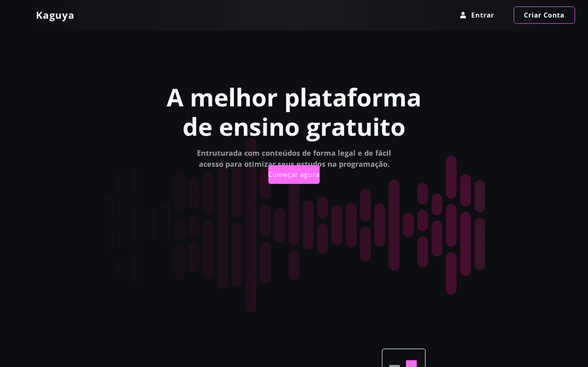
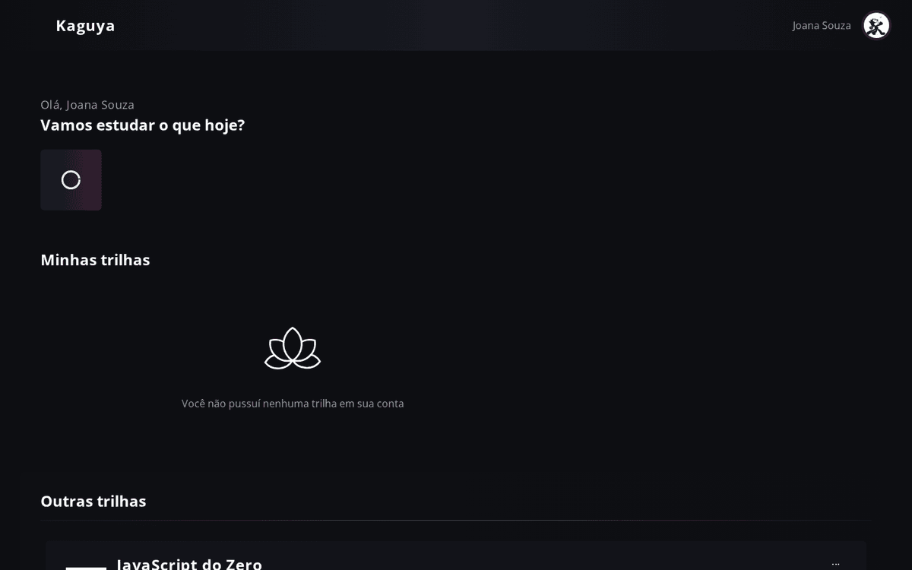
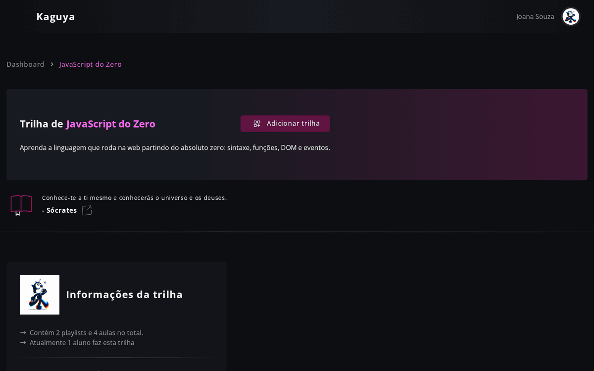
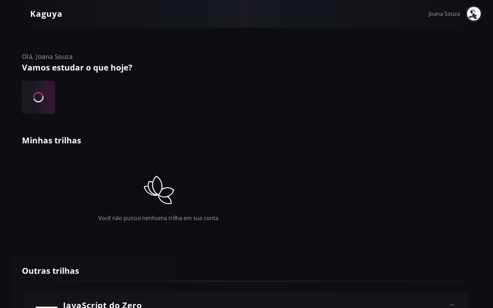
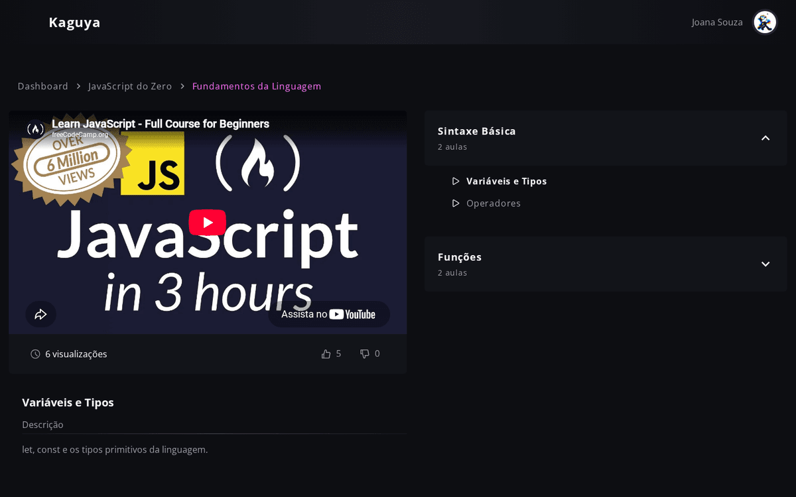
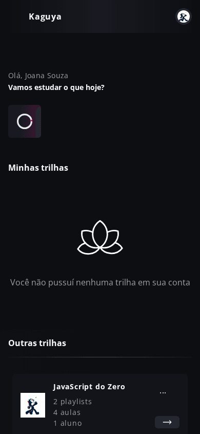

# Kaguya

<p align="center">
  
</p>

Kaguya is a learning platform for structured study trails. Students progress
through trails made of playlists, blocks and video lessons, track completion
and keep a watch history. Content is managed by sub administrators through a
role based access layer.

This repository is a monorepo with three independent applications:

| App | Path | Stack |
| --- | --- | --- |
| REST API | `apps/backend` | Express, TypeScript, Prisma 6, PostgreSQL, Zod |
| Web client | `apps/next-app` | Next.js 15 (pages router), React 19, Chakra UI, Firebase Auth |
| Suggestions subgraph | `apps/suggestions-microservice` | NestJS 11, GraphQL federation v2, Prisma 6 |

## Screenshots

| Dashboard | Trail |
| --- | --- |
|  |  |

| Playlists and blocks | Lesson player |
| --- | --- |
|  |  |

| Mobile dashboard |
| --- |
|  |

## What it demonstrates

- Clean architecture style layering on the API: routes, controllers, services,
  repositories, DTOs and use cases per module
- Dependency injection with tsyringe and provider interfaces (hash, token,
  storage, auth) with swappable implementations
- Pluggable storage driver: disk by default for local runs, S3 via env vars
- Authentication in two flavors: local email plus bcrypt password issuing JWT,
  or Firebase social sign in exchanging the ID token for a backend JWT
- Role based access control with permission levels enforced by middleware on
  every administrative route
- Input validation on all endpoints with Zod schemas and a single error
  envelope of shape `{ data, error: { message, generic_code } }`
- Server side rendering auth guards (`withSSRAuth`, `withSSRGuest`) validating
  the session cookie against the API before rendering protected pages
- Client state split between react-query caches and a small auth context
- A federation v2 subgraph exposing trail suggestions, ready to compose into a
  supergraph

## Quickstart

Requirements: Node 22, Docker.

```bash
git clone https://github.com/tiagogcastro/kaguya.git
cd kaguya
npm install -g npm@latest # any modern npm works
docker compose up -d      # starts both postgres instances
```

Backend:

```bash
cd apps/backend
cp .env.example .env      # adjust values if needed
npm install
npx prisma migrate deploy # creates the schema
npx prisma db seed        # roles, users and two full content trails
npm run dev:server        # http://localhost:3399
```

Web client:

```bash
cd apps/next-app
cp .env.example .env.local # point NEXT_PUBLIC_KAGUYA_API_BASE_URL at the api
npm install
npm run dev                # http://localhost:3000
```

Suggestions subgraph (optional):

```bash
cd apps/suggestions-microservice
cp .env.example .env
npm install
npx prisma migrate deploy
npm run start:dev          # graphql at http://localhost:3333/graphql
```

### Seeded accounts

| Role | Email | Password |
| --- | --- | --- |
| Admin | `app@kaguya.com.br` (or your `ADMIN_ACCESS`) | `app12345` (or your `ADMIN_PASS`) |
| Sub admin | `sub@kaguya.com.br` | `sub12345` |
| Student | `joana@kaguya.com.br` | `joana12345` |

Social login requires real Firebase credentials; without them every other flow
still works with the seeded accounts above.

## Useful scripts

From the repository root:

```bash
docker compose up -d            # databases
npm run dev:backend             # express api
npm run dev:web                 # next client
npm run dev:suggestions         # nest subgraph
npm run build:backend           # production builds per app
npm run build:web
npm run build:suggestions
```

Inside `apps/backend`:

```bash
npm run smoke                   # hits every route in dependency order
npm test                        # unit + integration jest suites
```

## API surface

All authenticated requests use `Authorization: Bearer <token>`. Errors always
return `{ "data": null, "error": { "message", "generic_code" } }`.

Groups: `/users`, `/sessions`, `/profile`, `/roles`, `/histories`, `/trails`,
`/blocks`, `/lessons`, `/playlists`, `/likes`, `/user-trails`,
`/user-playlists` and the protected `/sub-admins/*` management group.
Run `npm run smoke` inside the backend to see every endpoint exercised.

## Roadmap

- [ ] Migrate the web client to Chakra UI v3 (theme system and toaster rewrite)
- [ ] Enable the GitHub sign in button once an OAuth app is configured
- [ ] Add password recovery flow
- [ ] Compose the suggestions subgraph behind a gateway and consume it from the
      web client (pages are mocked today)
- [ ] Activate the Kafka consumer that provisions suggestive records when the
      integration is turned on (`KAFKA_ENABLED=true`)
- [ ] Frontend test suite (the API ships unit, integration and smoke suites)

## Project history

Built between 2021 and 2023 as a team project where I worked as one of the
developers alongside Marcos Proenca. In 2026 I restored it: upgraded every
dependency while keeping the original stack, fixed security issues found in a
full audit, squashed migrations, added seeds, tests and documentation.

## Author

Built by [Tiago Gonçalves de Castro](https://github.com/tiagogcastro) · [LinkedIn](https://www.linkedin.com/in/tiagogcastro)

## License

MIT
